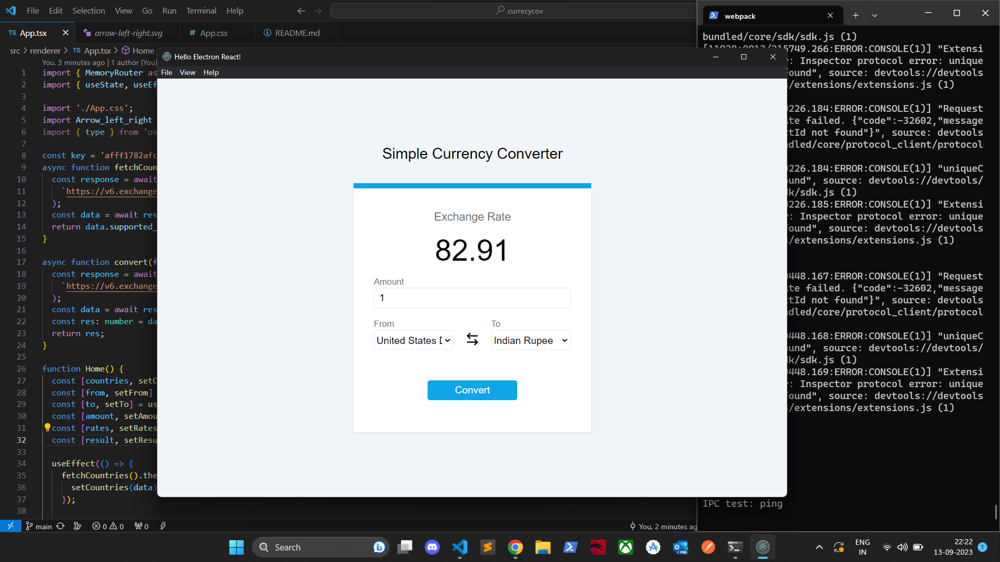
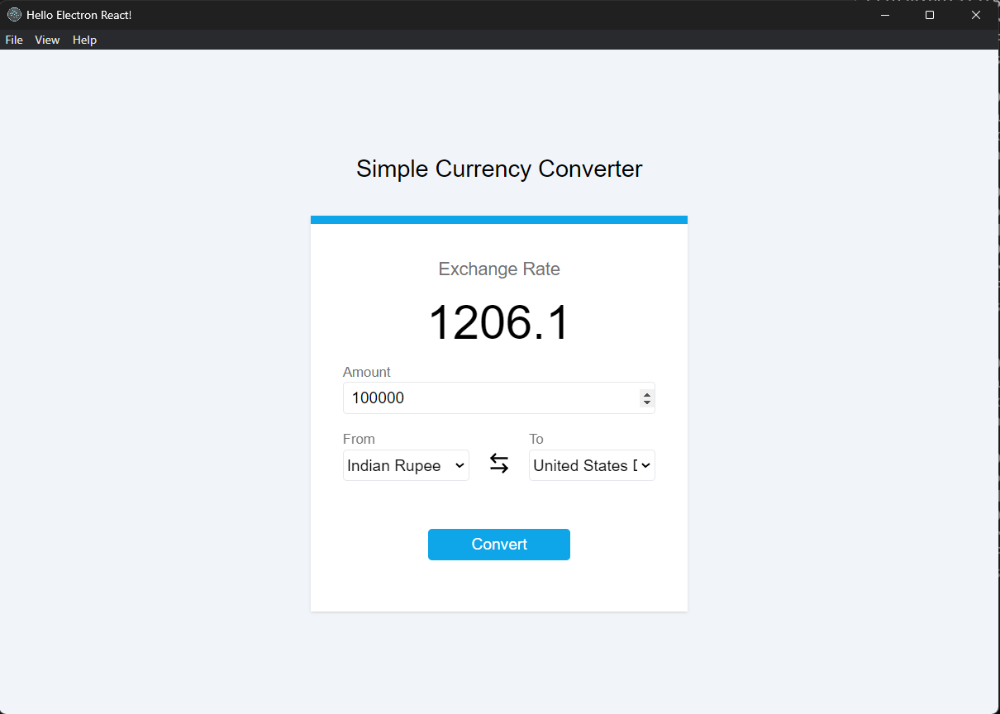
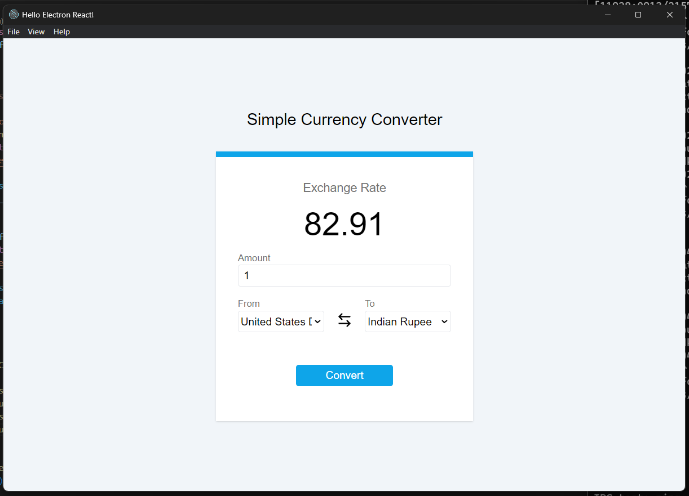

# Currency Conversion App

This is a simple currency conversion web application built using React on the client-side and Node.js with Express.js on the server-side. It allows users to convert between different currencies using up-to-date exchange rates.

## Features

- User-friendly interface for currency conversion.
- Real-time exchange rate data obtained from a third-party API.

## Technologies Used

- **Frontend**: React, Axios for HTTP requests, React Router for routing.
- **External API**: [ExchangeRatesAPI](https://www.exchangerate-api.com/) for real-time exchange rate data.

## Installation

1. Clone the repository:

   ```bash
   git clone https://github.com/your-username/currency-conversion-app.git
   cd currency-conversion
   ```

2. Install frontend dependencies:

   ```bash
   cd client
   npm install
   ```

3. Install backend dependencies:

   ```bash
   cd server
   npm install
   ```

4. Create a `.env` file in the `server` directory and add your API key obtained from [ExchangeRatesAPI](https://www.exchangerate-api.com/):

   ```env
   API_KEY=your_api_key_here
   ```

## Usage

1. Start the client:

   ```bash
   cd client
   npm start
   ```


## API Rate Limiting

The app uses the `API_KEY` to fetch exchange rate data from the [ExchangeRatesAPI](https://www.exchangerate-api.com/). Be mindful of the rate limits imposed by the API to avoid disruptions in service.



